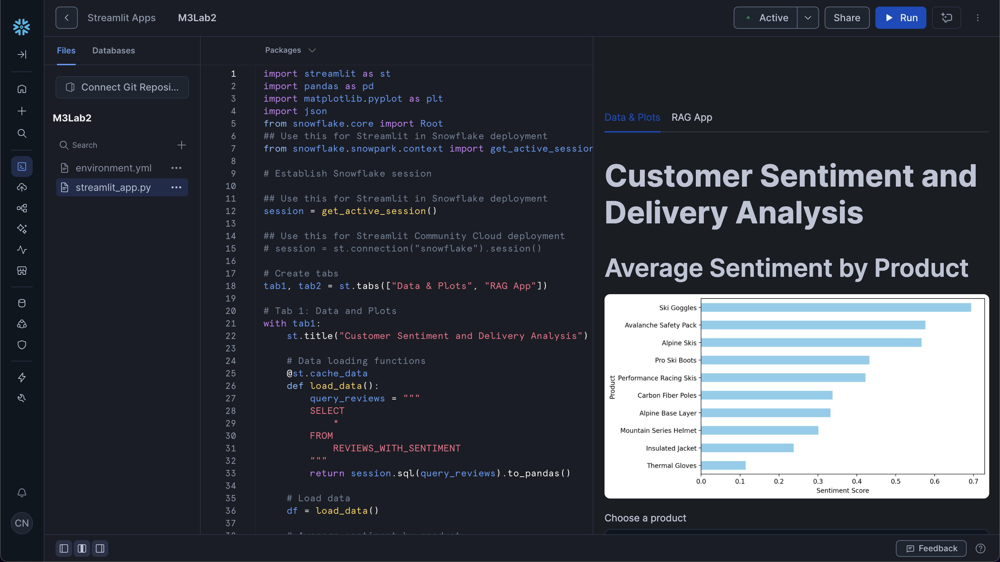

<h1 align="center">Fast Prototyping of a GenAI App with Streamlit</h1>

<p align="center">
  <b>From a local data-cleaning tool to a cloud-native, RAG-powered AI data assistant.</b><br>
  Streamlit UI · Snowflake Cortex (LLMs + Cortex Search) · Retrieval-Augmented Generation.
</p>

<p align="center">
  <a href="https://github.com/LTolo/Fast-Prototyping-of-a-GenAI-App-with-Streamlit/actions/workflows/ci.yml"></a>
  
  
  
  <a href="LICENSE"></a>
</p>

---

This repository contains the projects built during the **DeepLearning.AI** course
*"Fast Prototyping of GenAI Apps with Streamlit"*. It demonstrates the evolution
from a basic local data-processing tool into a fully integrated, cloud-native
AI-powered data assistant, using the hypothetical **Avalanche** winter-sports
dataset (customer reviews + shipping logs).

## Project overview

The project progresses through **three stages**, showing how to build, scale, and
integrate LLMs into a data application.

### 📁 [01 — Data Ingestion & Cleaning](./01-GenAi-Data-Ingestion-and-Cleaning)

The fundamentals of Streamlit and local data handling.
- **Features:** CSV ingestion, automated text cleaning with Regex, interactive charts.
- **Stack:** Streamlit · Pandas · Python (Regex).
- **Goal:** Master `st.session_state` and build a responsive UI layout.

### 📁 [02 — Cloud-native Data Assistant](./02-GenAi-Data-Assistant)

Turning the prototype into a cloud-native AI assistant on Snowflake.
- **Features:** Direct Snowflake connection, sentiment visualizations, and a
  natural-language chatbot powered by **Claude 3.5 Sonnet** via Snowflake Cortex.
- **Stack:** Streamlit · Snowflake (Snowpark & Cortex) · Matplotlib.
- **Goal:** Query data in plain English; deploy an enterprise-grade GenAI app.

### 📁 [03 — Advanced RAG & Chatbot](./03-GenAi-Advanced-Rag-and-Chatbot)

Enterprise-grade features and a full RAG architecture.
- **Features:** **Cortex Search** semantic-search pipeline, multi-tab UI,
  persistent chat history (`st.session_state`), and multi-model selection
  (Claude 3.5 · Mistral · Llama 3).
- **Stack:** Snowflake Cortex Search · Streamlit Tabs & Chat elements.
- **Goal:** Implement a production-style RAG pipeline over the review corpus.

## Demo — Advanced RAG chatbot (module 03)

The deployed Streamlit-in-Snowflake app, running the Cortex Search RAG pipeline:

<p align="center">
  
</p>

## Getting started

```bash
git clone https://github.com/LTolo/Fast-Prototyping-of-a-GenAI-App-with-Streamlit.git
cd Fast-Prototyping-of-a-GenAI-App-with-Streamlit

# Install the core dependencies:
pip install streamlit pandas snowflake-snowpark-python matplotlib

# Run a module (module 01 works fully locally):
streamlit run 01-GenAi-Data-Ingestion-and-Cleaning/streamlit_app.py
```

> **Snowflake modules (02 & 03):** configure `.streamlit/secrets.toml` with your
> Snowflake credentials. **Do not commit this file** — it's already covered by
> `.gitignore`.

## Testing

Standalone unit tests cover the core logic (text cleaning + retrieval) without
needing any cloud credentials, and run automatically in CI:

```bash
pip install pytest
pytest tests/ -q
```

## Tech stack

**Python 3.11+** · **Streamlit** · **Snowflake** (Snowpark · Cortex · Cortex
Search) · **Pandas** · **Matplotlib** · **pytest** · **GitHub Actions**

## License

Released under the [MIT License](LICENSE).

---

*Disclaimer: This project was built as part of the DeepLearning.AI course
curriculum ("Fast Prototyping of GenAI Apps with Streamlit").*
